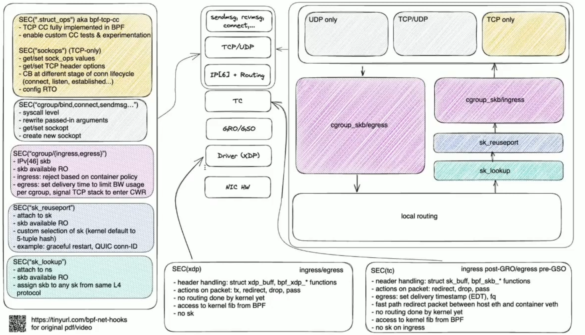

## The general purpose usage of inserting bpf and modify state in kernel
I'm leveraging `kretprobe_overwrite_return`, an API was supposed to inject the fault to arbitrary kernel function. Latest Intel CPU has codesign for not flushing the ROB for these trampolines.

### kprobe impl
instrument on any instruction to jmp to `pre_handler`->function
### kretprobe impl
`__kretprobe_trampoline_handler` to hijack the pc to the trampoline code
### uprobe impl
trap the user space instruction to `pre_handler`->function
### bpftime impl
make a map in the userspace and use LLVM JIT to hook the function to write the map, no context switch, no ROB flush

## eBPF hardening tool
The Linux kernel has its eBPF verifier that achieves these guarantees by undertaking a strict static analysis across all eBPF programs, checking all paths for invalid memory accesses and disallowing loops to ensure termination.

- Spectre v1 Bound check bypass (mitigated by lfence or verifier)
- Spectre v2 Branch Target Injection (before loaded to the kernel mitigated by disabling interpreter)
- unprivileged BPF for SOCKET_FILTER and CGROUP_SKB only
## Replace UserBypass
Compare with SFI way of protecting the boundary, the static compilation with security checks that do not introduce extra checking is always expensive.

## Replace XRP
XRP's idea is syscall batching. We can take the mmaped buffer as a fast pass to User space programming offloading the file system operations to the firmware. io_uring or BPF FUSE has already gotten into the senario.

Need data plane in cross boundary communication. control plan in separate U/K.

### Current userspace kernel space interaction

- Bpf Arena https://lwn.net/Articles/961594/
- Share user memory to BPF program through task storage map. https://lore.kernel.org/bpf/20240816191213.35573-1-thinker.li@gmail.com
- bpf_probe_write_user_register https://lore.kernel.org/bpf/20240404190146.1898103-1-elver@google.com/
- 
## Why eBPF for security is wrong
BPF_LSM on loading will enter a previledge mode, it will be hard to maintain the context whether the current thread's permission for memory is complicated, and with page fault or EL1->EL2(arm) change will be hard to maintain.

- can read arbitrary kernel data (can not be per cgroup)
- can deny operations
- can sleep

## KFuncs explosion
We can see much more KFuncs is exported for helper function and verification. https://ebpf-docs.dylanreimerink.nl/linux/kfuncs/ 

## Hot topics
- Hooks:
  - scheduler + bpf
  - hid + bpf
  - oom + bpf
  - fuse + bpf
  - userfaultfd + bpf

## Reference
1. https://lore.kernel.org/lkml/202209030333.Goj9I0Pe-lkp@intel.com/T/
2. https://www.kernel.org/doc/html/latest/bpf/index.html
3. https://www.youtube.com/watch?v=kvt4wdXEuRU