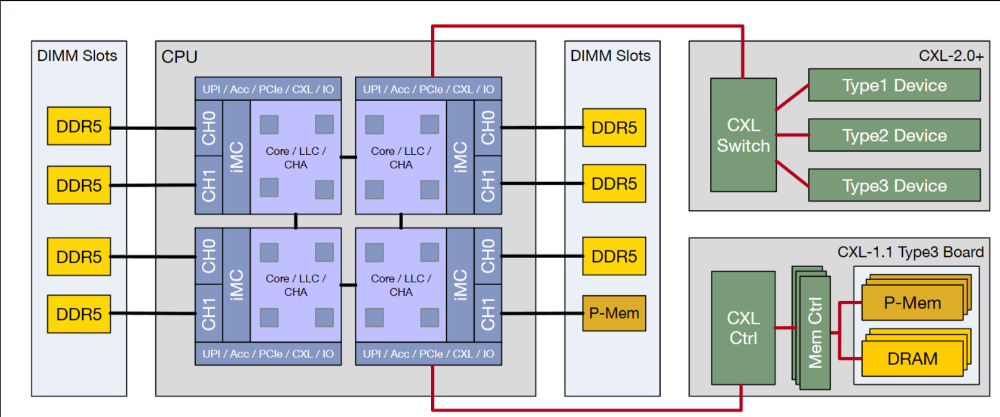

# What's outcome of Network of chip 

The Cache Home Agent consists of Address Generation Unit(AGU), Address Translation Unit(ATU). The AGU is responsible for generating the physical address from the virtual address. The ATU is responsible for translating the physical address to the cache line address. The scheduling mechanism in the CPU includes:

1. the fastest route from one CHA to the other.
2. the scheduler for fetch exclusive/ fetch share/ invalidate before sharing or upgrade to directory based coherence protocol.
3. CXL related: how to save message for remote fabric accesses?

## Reference
1. SDM: Sharing-Enabled Disaggregated Memory System with Cache Coherent Compute Express Link
2. Demisifying CXL