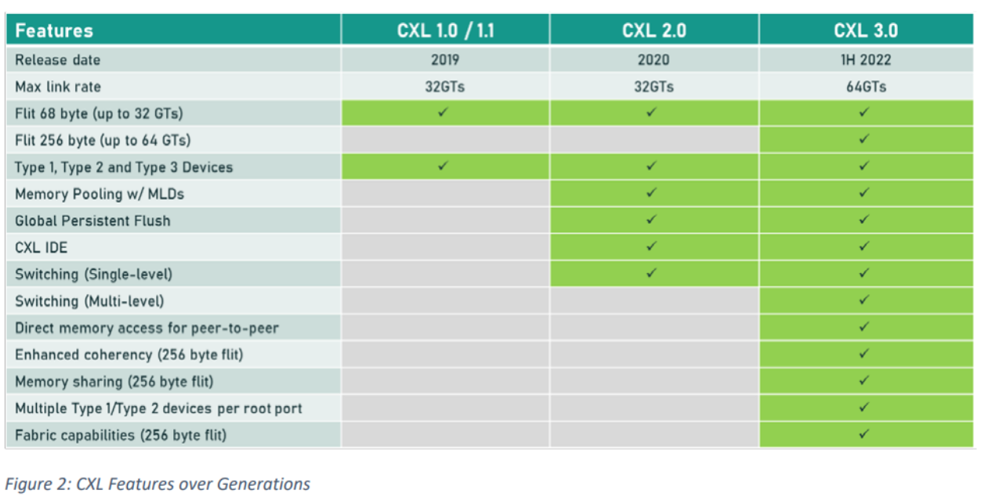
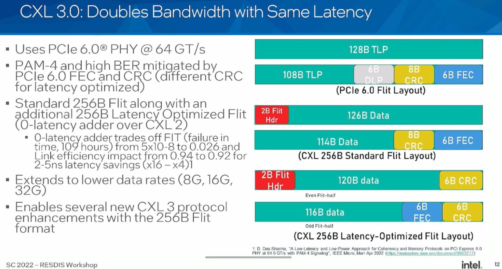
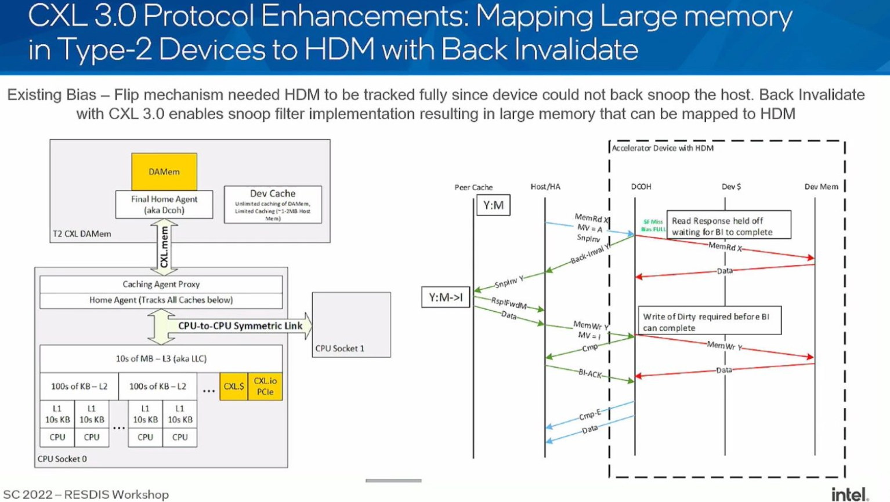

# Hardware Part
## SerDes
On chip decoding and encoding of the PCIe signal. The SERDES is a high speed serial transceiver that converts parallel data into serial data and vice versa. If for optics media, there's optics to electrical conversion. The performance number is worse than expected for pure CXL2.0 out of rack standalone switch. It's 90ns for accessing one hop of switch from Xconn [4]

CXL 1.1 is the current production ready version of CXL. It builds a new set of protocols and modernizes existing ones to run on top of  PCI Express (PCIe) physical layer which in turn benefits from the evolution of serial links enabled by advances in Ethernet SerDes (serializer-deserializer) IPs as Ethernet continues its march from 100 gigabit to 200, 400 and 800 Gbps speeds using respectively 56 Gbps, 112 Gbps, and likely 224 Gbps SerDes.

## TLP

### ATS
Address Translation Service
#### Remote Memory Translation Idea
Utilizing remote memory and don't hurt the host CPU with flushing the TLB or irq the host CPU is a problem.

## FLIT
Hardware hack for doubling the bandwidth with same latency. Squeezing the data into the same space slot.

## Ordering

1. PCIe
2. CXL

## Dynamic Capacity Devices
- Pooling implemented by 2GB segmentation, Pretty Production Ready.
- Sharing with a chip do labeling, Still PoC.
- Sk Hynix booth at SC23 has a online memory tracing for PNNL Super Cluster but not for CXL.

## Reference
1. PCIe Express book
2. [Rebooting Virtual Memory with Midgard](https://www.cs.yale.edu/homes/abhishek/sidgupta-isca21.pdf)
3. [Comparison of CXL1.1 and 2.0](https://www.electronicdesign.com/technologies/embedded/article/21249351/cxl-consortium-whats-the-difference-between-cxl-11-and-cxl-20)
4. [Xconn's Switch](https://www.hpcwire.com/off-the-wire/xconn-technologies-debuts-industrys-1st-hybrid-cxl-2-0-and-pcie-gen-5-switch/)
5. [Liquid Full Stack](https://www.youtube.com/watch?v=CEMNKp-WPu0)