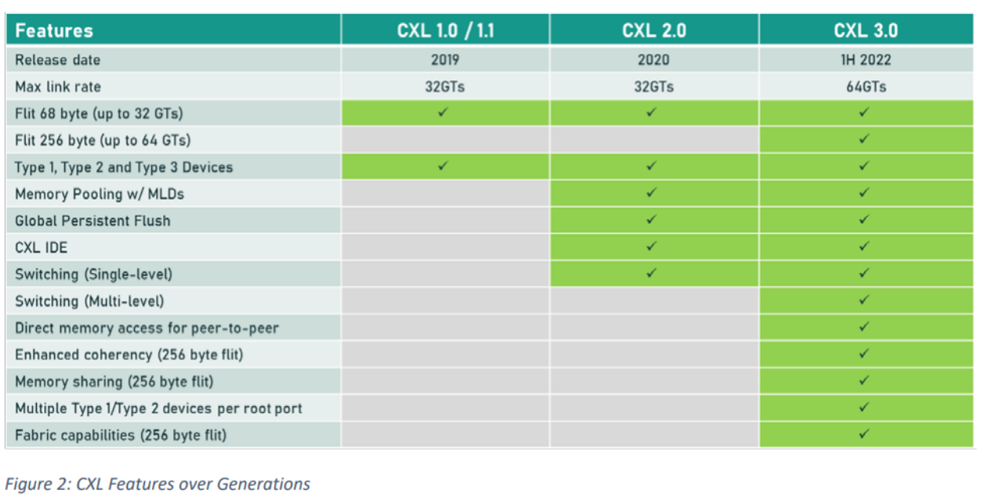
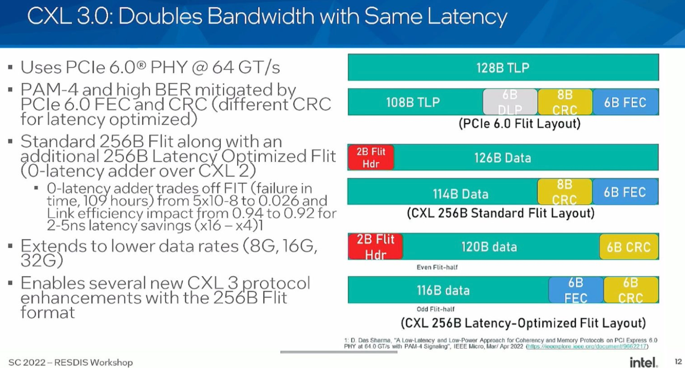
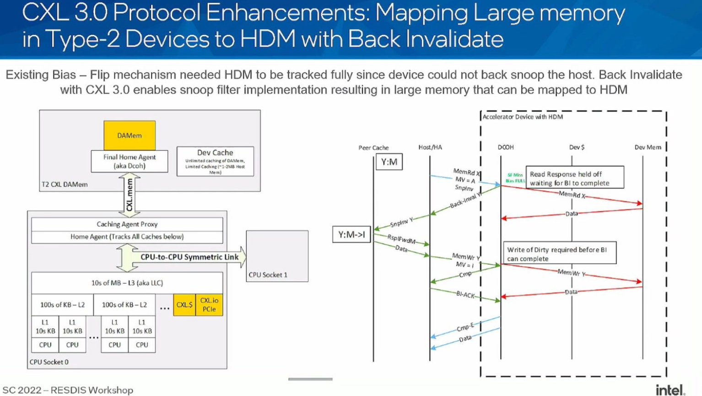

# Hardware Part
## SerDes
On chip decoding and encoding of the PCIe signal. The SERDES is a high speed serial transceiver that converts parallel data into serial data and vice versa. If for optics media, there's optics to electrical conversion. The performance number is worse than expected for pure CXL2.0 out of rack standalone switch. It's 90ns for accessing one hop of switch from Xconn [4]

CXL 1.1 is the current production ready version of CXL. It builds a new set of protocols and modernizes existing ones to run on top of  PCI Express (PCIe) physical layer which in turn benefits from the evolution of serial links enabled by advances in Ethernet SerDes (serializer-deserializer) IPs as Ethernet continues its march from 100 gigabit to 200, 400 and 800 Gbps speeds using respectively 56 Gbps, 112 Gbps, and likely 224 Gbps SerDes.

## TLP

### ATS
Address Translation Service, 
#### Remote Memory Translation Idea
Utilizing remote memory and don't hurt the host CPU with flushing the TLB or irq the host CPU is a problem.

## FLIT
Hardware hack for doubling the bandwidth with same latency. Squeezing the data into the same space slot.

## Ordering

1. PCIe
2. CXL

## Dynamic Capacity Devices
- Pooling implemented by 2GB segmentation, Pretty Production Ready.
- Sharing with a chip do labeling, Still PoC.
- Sk Hynix booth at SC23 has a online memory tracing for PNNL Super Cluster but not for CXL.
Here is a comprehensive guide and a drafted abstract for your patent application regarding **"GPU<->CXL P2PDMA KV Cache Management on a PCIe2CXL Bridge."**

### 1. Invention Analysis & Technical Logic
To write a strong patent abstract, we must define the "inventive step"—the specific technical problem you are solving and the novel hardware/software mechanism used to solve it.

*   **The Problem:** Large Language Model (LLM) inference generates massive Key-Value (KV) caches that exhaust GPU High Bandwidth Memory (HBM). Offloading to host DRAM via CPU is slow (high latency, bandwidth contention). Existing CXL solutions often still require host CPU intervention for memory mapping or data copying.
*   **The Solution (The "Invention"):** A specialized **PCIe-to-CXL Bridge** that acts as an intelligent intermediary. Instead of just routing signals, this bridge contains a dedicated hardware unit (a "KV Management Unit") that manages the memory pool.
*   **Key Innovation:**
    1.  **Protocol Translation:** Converts PCIe memory read/write requests (from legacy GPUs) directly into CXL.mem commands (for CXL memory expanders).
    2.  **P2PDMA Enabler:** Facilitates Peer-to-Peer Direct Memory Access, allowing the GPU to read/write CXL memory directly without the host CPU touching the data.
    3.  **Bridge-side Logic:** The bridge itself manages the *allocation* and *indexing* of the KV cache, freeing the GPU from complex memory management overhead.

---

### 2. Drafted Patent Abstract
*This abstract is written in standard patent legalese, suitable for a utility patent application. It focuses on the system, the apparatus (the bridge), and the method.*

**Title:**
**Apparatus and Method for Peer-to-Peer KV Cache Management via PCIe-to-CXL Bridge with Hardware-Accelerated Protocol Translation**

**Abstract:**
Disclosed are a system, method, and apparatus for managing Key-Value (KV) cache data in Large Language Model (LLM) inference systems utilizing hybrid memory interconnects. The system comprises a PCIe-to-CXL (PCIe2CXL) bridge device interconnecting a PCIe-attached Graphics Processing Unit (GPU) and a Compute Express Link (CXL) Type-3 memory expander. The bridge device includes a hardware-based KV Cache Management Unit (KVMU) and a Direct Memory Access (DMA) engine configured to establish a Peer-to-Peer (P2P) data path between the GPU and the CXL memory. The KVMU intercepts memory access requests from the GPU, performs low-latency address translation between the GPU’s PCIe address space and the CXL Device Physical Address (DPA) space, and executes CXL.mem protocol transactions. This architecture enables the GPU to offload KV cache blocks directly to CXL memory via P2PDMA, bypassing the host central processing unit (CPU) and system memory, thereby reducing inference latency, alleviating host bandwidth contention, and enabling scalable context window expansion for memory-constrained accelerators.

---

### 3. Key Claims/Embodiments to Expand Upon (For your full description)
When you write the full patent, you should detail these specific mechanisms derived from the abstract:

1.  **The "Smart" Bridge Architecture:**
    *   Describe the **Translation Layer:** How the bridge maps a "Virtual KV ID" or a PCIe Base Address Register (BAR) address to a physical CXL address.
    *   *Why it's novel:* Most bridges are "dumb" routers. Yours is "smart"—it understands KV cache semantics.

2.  **The P2PDMA Mechanism:**
    *   Explain that the GPU initiates a standard PCIe write, which the Bridge detects and converts to a CXL write.
    *   *Benefit:* "Zero-copy" transfer. The data goes `GPU -> Bridge -> CXL Memory`, never `GPU -> CPU RAM -> CXL Memory`.

3.  **KV Cache Specific Features (Optional but strong):**
    *   **Prefetching:** The Bridge could predict which KV blocks are needed next (based on token sequences) and fetch them into a small SRAM buffer on the bridge before the GPU asks.
    *   **Eviction:** The Bridge can handle "least recently used" (LRU) logic to move data between CXL and GPU without the Host OS interfering.

### 4. Keywords for Classification
*   Compute Express Link (CXL)
*   Peer-to-Peer Direct Memory Access (P2PDMA)
*   Large Language Models (LLM)
*   Key-Value (KV) Cache
*   Memory Expansion
*   Heterogeneous Computing

## Reference
1. PCIe Express book
2. [Rebooting Virtual Memory with Midgard](https://www.cs.yale.edu/homes/abhishek/sidgupta-isca21.pdf)
3. [Comparison of CXL1.1 and 2.0](https://www.electronicdesign.com/technologies/embedded/article/21249351/cxl-consortium-whats-the-difference-between-cxl-11-and-cxl-20)
4. [Xconn's Switch](https://www.hpcwire.com/off-the-wire/xconn-technologies-debuts-industrys-1st-hybrid-cxl-2-0-and-pcie-gen-5-switch/)
5. [Liquid Full Stack](https://www.youtube.com/watch?v=CEMNKp-WPu0)
