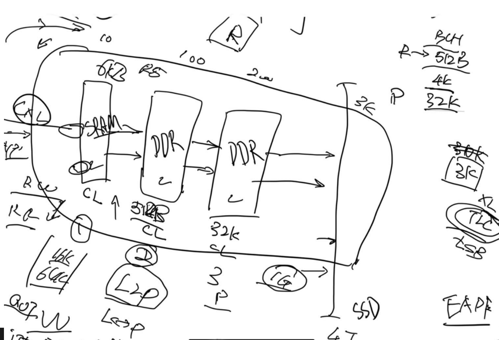

When I was designing the simulator I compared serveral back up solutions. I will tell why they are not working. So the problem is how to give ld/st interface desired delay from the application perspective.

## Hardware implementation
The original implementation of CXL.mem is they have a window inside the LLC, and if you access that 

## Physical unplug Solution
lsmem to turn off memory for emulating the remote memory access using UPI.

## PEMP dynamic region based Solution
Use a customed micro code for limiting the memory bandwidth to the region.

## DAMON Solution from Amazon's 
Fasttier and Memtis utilize DAMON, the histogram based calculation for memory access pattern. The problem is the future access is based on prediction rather than history. There might be more false positives. But it's currently

### Reference
1. https://airbus-seclab.github.io/qemu_blog/tcg_p3.html
2. https://lists.gnu.org/archive/html/qemu-devel/2017-01/msg03522.html
3. https://www.qemu.org/docs/master/devel/memory.html
