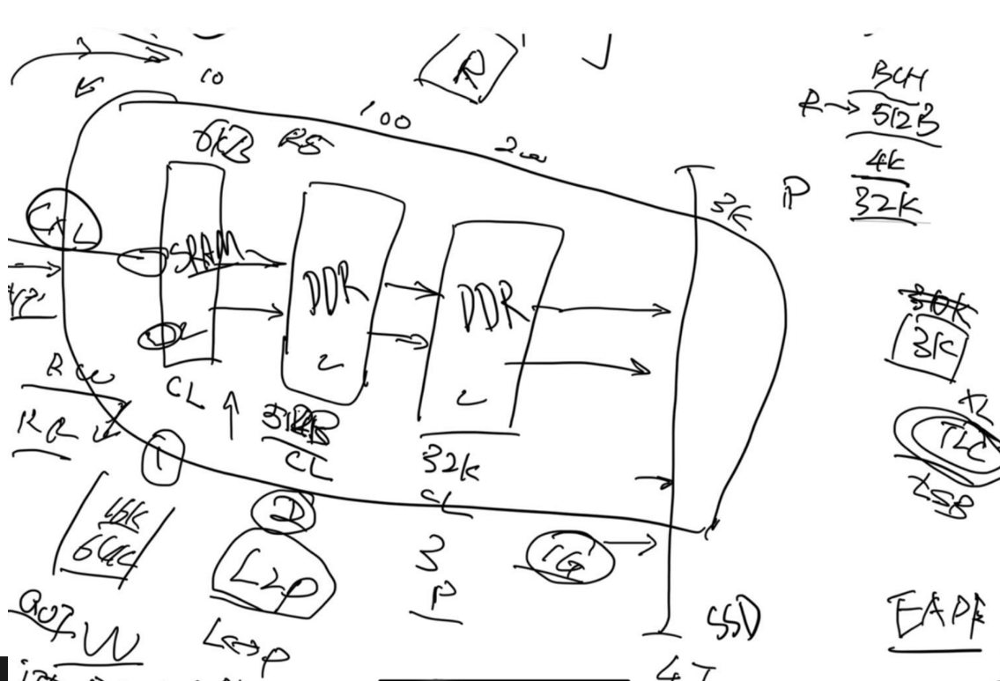

# Simulator Design for CXL Memory

When I was designing the simulator, I compared several backup solutions. The real problem is simple to say and annoying to implement: how do we give a normal load/store interface a controllable remote-memory delay from the application perspective?

If the application has to call a special API, we are no longer measuring transparent memory. If the delay is injected in the wrong layer, we are measuring the simulator.

## Hardware implementation
The original implementation direction for CXL.mem-like emulation is to create a window behind the LLC and attach a different latency model to accesses that hit that window.

The challenge is precision. Cache hits, prefetching, TLB behavior, and page migration all interact with the delay. A clean simulator needs to decide which layer owns the illusion.

## Physical unplug Solution
Use `lsmem` or memory hotplug controls to turn memory regions on/off and emulate remote access through another interconnect such as UPI.

This is attractive because it uses real hardware paths. It is weak because the control is coarse and does not expose the CXL-specific queueing and device behavior we care about.

## PEMP dynamic region based Solution
Use a custom microcode or platform mechanism to limit memory bandwidth for a region.

This can emulate bandwidth pressure, but latency is not just bandwidth. CXL workloads suffer from load-to-use delay, queueing, ordering, and coherence traffic.

## DAMON Solution from Amazon's 
Fasttier and Memtis-style systems use DAMON-like history to infer access patterns. That is useful for placement, but less ideal for a simulator. History-based migration can create false positives, and the act of migration changes the history we observe.

## What I want from the simulator

- normal pointers and normal loads/stores;
- controllable latency and bandwidth per region;
- visibility into queue depth and migration events;
- enough determinism for comparing policies;
- enough realism that prefetch and cache effects still matter.

### Reference
1. https://airbus-seclab.github.io/qemu_blog/tcg_p3.html
2. https://lists.gnu.org/archive/html/qemu-devel/2017-01/msg03522.html
3. https://www.qemu.org/docs/master/devel/memory.html
