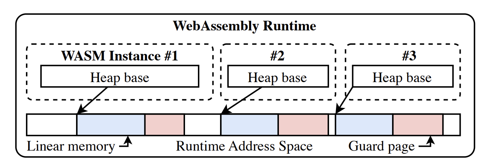

The WAMR memory is maintained in 1. Module Instance structure: WAMR maintains the module instance data using C struct “WASMModuleInstance”.
1. function data: contain the function instances and a few pointer arrays that refer to the native function, function type and imported functions
2. 3. linear memory: the memory for the linear memory data space and associated information
3. global data: the memory for the data of Wasm globals and associated information
4. exports:
5. tables:
6. WASI context
7. WASI-NN context

## The impact of linear memory
Every memory ptr is the offset to the mmap address. __data_end global and __heap_base global is decided to indicate the memory size. It can dynamically enlarge memory through wasm_runtime_enlarge_memory(), update heap base realloc and add place new guard page. This only supports 32bit memory, for 64bit memory, it needs more codesign like MPK/MTE.

Other than linear memory, we have multiple memory regions for the global data, the table data, the function data, and the module instance data. The memory regions are either mmaped or malloced and mantained by linker and loader which is largely OS and libc specific.

## InterpFrame, JITFrame & AOTFrame
The current WAMR frame model is implemented in a unified view after [PR #2830](). Whereas on each of WebAssembly branch, the native view will commit the register to the stack without going into the unified WASM Frame.

## Reference
1. https://github.com/bytecodealliance/wasm-micro-runtime/blob/main/doc/memory_tune.md
2. [Cage: Hardware-Accelerated Safe WebAssembly](https://arxiv.org/pdf/2408.11456)